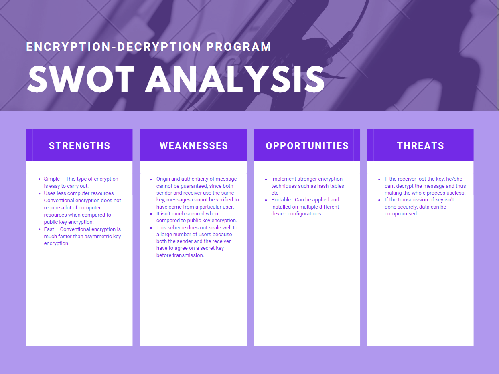

# Requirements

## Introduction
* The program is an implementation of Conventional Encryption techniques and provides a basic and simplistic overview of how encryption works in modern cryptographic techniques.
* Conventional encryption is a cryptographic system which uses same key used by sender to encrypt message and by receiver to decrypt message. It was only type of encryption in use prior to development of public-key encryption.
* It is still much preferred of the two types of encryption systems due to its simplicity. It is a relatively fast process since it uses a single key for both encryption and decryption In this encryption model, the sender encrypts plaintext using receiver’s secret key, which can be later used by receiver to decrypt ciphertext. 
* Below is an image which provides a basic illustration of this concept (Source : [GeeksForGeeks](geeksforgeeks.com))

## Research

Referring to the image above : 
> Suppose A wants to send a message to B, that message is called plaintext. Now, to avoid hackers to read plaintext, plaintext is encrypted using algorithm and a secret key (at 1). This encrypted plaintext is called ciphertext. Using same secret key and encryption algorithm run in reverse(at 2), B can get plaintext of A and thus message is read and security is maintained.

### Parts of a Conventional Encryption System : 
* Plain text – It is the original data that is given to the algorithm as a input
* Encryption algorithm – This encryption algorithm performs various transformations on plain text to convert it into cipher text.
* Secret key – Secret key is also an input to the algorithm. The encryption algorithm will produce different output based on the keys used at that time.
* Cipher text – It contains encrypted information because it contains a form of original plaintext that is unreadable by a human or computer without proper cipher to decrypt it. It is output from algorithm.
* Decryption algorithm – This is used to run encryption algorithm in reverse. Cipher text and Secret key is input here and it produces plain text as output.

### Requirements for secure use of conventional encryption :
* We need a strong encryption algorithm.
* Sender and Receiver must have obtained copies of the secret key in a secure fashion and must keep the key secure.

### Implementation of encryption : 
* The program utilises a modification of the ROT-13 encryption algorithm, providing users to replace the +-13 from the algorithm with a variable `key`, to encrypt and decrypt the data
* Provided that the key for decryption is provided securely, the program can decrypt the file for the required output, otherwise it will provide with a different output with a different key
* Given the infinitesimal amount of numbers that the variable `key` can hold, it can still provide for a psychotic breakdown to any inexperienced hackers who might try to decrypt the file with an invalid key, and avoid compromise of data

## SWOT Analysis : 

## 4W's and 1H : 

### Who -
* Individuals/Small Groups
### What - 
* People who want to send encrypted data to avoid loss of confidentiality of data
### When -
* Conventional Encryption has been used since centuries, but this particular implementation can be used in modern computers to encrypt and decrypt data

### Where - 
* Environments that deal with sensitive information and cannot risk compromise of any confidential data

### How - 
* By utilising this program, people can encrypt their data and stay worry-free about losing the confidentiality of the information from inexperienced hackers, provided the key is not compromised

## System Requirements
* Processor : Modern Intel Celeron/Pentium equivalent (Dual-Core)
* RAM : 2GB (minimum)
* Storage : 10MB free space
* Operating System : Windows 10/Linux/MacOS

## Software Requirements
* Operating System : Windows 10/Linux/MacOS
* Compiler : MinGW (Windows) / gcc (Linux/MacOS) with make
* CLI : cmd/Powershell (Windows) / bash/zsh (Linux/MacOS)
* Testing : cppcheck, valgrind (Linux) / Dr. Memory (Windows)

